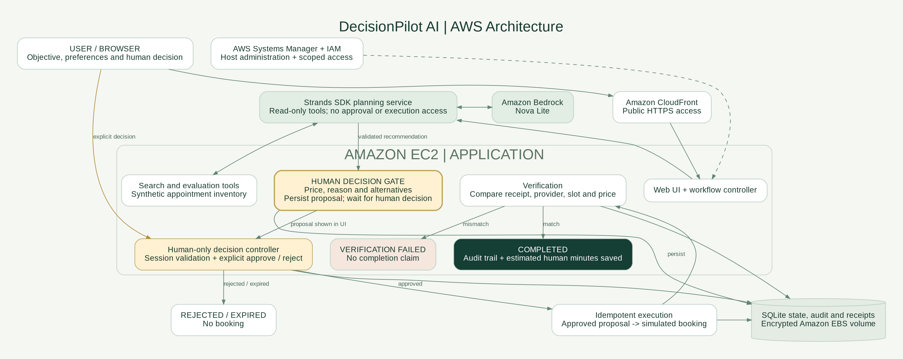

# DecisionPilot AI

**Your agent does the work. You make the call.**

[Live demo](https://d2bjqcxkm4ezmd.cloudfront.net) · [GitHub repository](https://github.com/babifarah9/decisionpilot-ai) · [MIT license](LICENSE) · [Architecture](architecture/architecture.png) · [Setup and deployment](docs/deployment.md) · [Submission kit](docs/submission_draft.md) · [Validation status](docs/validation.md)

DecisionPilot AI handles the comparison and coordination behind routine personal administration, then pauses for a human decision before an action can commit money or time. Built for the **Everyday Agents** track of AWS **Agents for Humans**, using the **Strands Agents SDK** and an Amazon Bedrock integration.

> **Current release:** live Strands/Bedrock planning passed on September 13, 2026 using Amazon Nova Lite and stopped at the Human Decision Gate ([evidence run](https://github.com/babifarah9/decisionpilot-ai/actions/runs/34779404240)). The 32 safety/API tests and SDK construction checks pass. The owner completed the EC2/CloudFront deployment and reported a passing origin health check in Bedrock mode. [Open the public demo](https://d2bjqcxkm4ezmd.cloudfront.net). The owner confirmed successful approval/completion and rejection flows on the live demo. A supplied screenshot confirms desktop landing-page rendering. Mobile, session-isolation and restart acceptance checks remain pending; the assistant could not independently operate the live browser. AgentCore is not deployed. See [hosting instructions](docs/public-demo-next-step.md). All providers, prices and bookings are simulated, including in Bedrock mode; no garage is contacted or payment taken.

## Try it in under a minute

Python 3.12–3.14 is required. The offline demonstration needs no third-party packages or AWS account.

```bash
cd decisionpilot-ai
python -m decisionpilot.server
```

Open **http://localhost:8080**. Enter the objective, confirm budget/time preferences, and select **Find my best appointment**:

> Schedule my annual car service under $180. I prefer a morning appointment and want the best balance of rating and price.

The application evaluates four synthetic appointments and recommends AutoCare Central at **$139**, rating **4.7**, at **08:30**, dated relative to the run. It shows the price, reasoning, alternatives and pending state. Select **Approve simulated booking** to resume execution and verification, or **Reject** to stop without booking. Refreshing preserves access using the browser's session cookie and the local database. Recent workflows appear in the sidebar.

The objective is context; the explicitly confirmed numeric budget and daypart govern selection. This MVP handles annual car service only. Keep the text and fields consistent. Prices are illustrative all-in **USD**, and “under” is strict: a $180 quote does not meet a $180 limit. Appointment times are illustrative provider-local times; no real timezone/calendar integration is claimed.

## What makes the decision gate different?

**The autonomous agent has no tool to approve—or execute—its own action.** This is enforced by its tool set and the application state machine, not just a prompt.

1. A fresh Strands Agent receives the objective and confirmed constraints. Its two tools can only search and rank synthetic appointments.
2. Structured output identifies a proposed candidate. The controller independently checks that it is the strongest eligible candidate in trusted inventory.
3. The controller saves an expiring, fingerprinted proposal and enters `WAITING_FOR_HUMAN`. Planning ends.
4. A separate browser request, with session ownership, same-origin and CSRF checks, records explicit approval or rejection. No approval credential reaches the LLM.
5. Only an approved, unchanged, unexpired proposal can execute. The executor records a simulated receipt under a unique proposal key, so retries and concurrent requests do not duplicate bookings.
6. Verification compares the provider receipt with the approved provider, slot and price. Only a match enables `COMPLETED` and estimated time savings.

A rejection ends the workflow. Change preferences and start a fresh workflow to reconsider. Approval cannot be replayed or changed into a different decision. A failed verification withholds completion. This is a single-host synthetic demo, not a production payment or identity system. A database administrator or compromised server process is outside the threat boundary; audit rows are transactional, not tamper-proof.

## Architecture



[Editable SVG](architecture/architecture.svg) · [Mermaid source](architecture/architecture.mmd) · [State machine](architecture/states.mmd)

The UI and human controller persist workflow state, decisions, receipts and audit events in SQLite. Use a persistent volume on one host. AgentCore, when enabled, hosts only the **stateless planner**; do not place approval state on its ephemeral filesystem. Optional EC2/EBS hosting and AgentCore are prepared deployment paths, not deployed services.

## Transparent selection

For each appointment:

```text
score = 100 × (0.5 × rating/5 + 0.5 × max(0, 1 − price/budget))
```

Budget and daypart are eligibility constraints, not soft score bonuses. The highest eligible score wins; price, appointment time and stable ID break ties. This simple, disclosed rule defines “balance” for this MVP; it is not a learned preference model. All four alternatives remain visible, including ineligible ones.

## Human Attention Budget

The user supplies a manual baseline, initially **35 minutes**. Active browser time includes objective entry and decision review; hidden tabs and idle periods longer than 30 seconds are excluded. The estimate is:

```text
estimated minutes saved = max(0, manual baseline − active attention seconds / 60)
```

Savings are credited **only after verified completion**. For example, a 35-minute baseline and 60 seconds of attention yield 34 estimated minutes saved. This is an illustrative estimate, not a measured productivity or clinical claim. Browser activity is an imperfect proxy and does not capture effort elsewhere. The server validates the submitted duration but cannot independently prove human attention.

## Enable real Strands + Amazon Bedrock

After the account owner authorizes metered AWS calls and configures local credentials:

```bash
python -m venv .venv
source .venv/bin/activate
python -m pip install '.[aws]'
python -m pip check
python scripts/check_sdk.py
export AWS_REGION=us-east-1
export DECISIONPILOT_MODEL=amazon.nova-lite-v1:0
python scripts/bedrock_smoke.py --allow-aws-call
export DECISIONPILOT_MODE=bedrock
python -m decisionpilot.server
```

Windows PowerShell: activate with `.venv\Scripts\Activate.ps1`; set environment values with `$env:AWS_REGION="us-east-1"` and `$env:DECISIONPILOT_MODE="bedrock"`.

Use IAM Identity Center/SSO locally or an instance role on AWS. Never commit keys or paste them into chat. Example least-privilege model policy: [deploy/bedrock-policy.json](deploy/bedrock-policy.json). Model availability/access is account and region dependent. Failure surfaces as `FAILED`; the app never silently substitutes offline results. See [deployment instructions](docs/deployment.md) for model troubleshooting, AgentCore and HTTPS hosting.

Dependencies use bounded version ranges. GitHub CI has validated installation; a reproducible release lockfile still needs to be captured from that environment before release.

## Test

```bash
python -m unittest discover -s tests -v
python scripts/safety_demo.py
python scripts/scan_secrets.py
```

**32 tests passed** on Python 3.12 in the build environment: approval lifecycle, rejection, ownership, concurrency, expiration, tampering, no-match, strict budget, restart persistence, verification failure, HTTP API, CSRF and origins. CI also installs the actual SDK and validates construction; see the repository Actions tab for its result. The optional smoke test performs a real model call and must be run with authorized AWS access.

## Project map

| Path | Purpose |
|---|---|
| `decisionpilot/agent.py` | Strands planner, structured output, Bedrock and optional AgentCore client |
| `decisionpilot/tools.py` | Exactly two read-only tools |
| `decisionpilot/state.py` | Transactional workflow, decisions, receipts and audit |
| `decisionpilot/catalog.py` | Synthetic inventory and transparent ranking |
| `decisionpilot/server.py`, `decisionpilot/web/` | Session-scoped HTTP controller and responsive UI |
| `agentcore_main.py` | Planning-only AgentCore entrypoint |
| `deploy/` | HTTPS container configuration and AWS IAM policy |
| `tests/`, `scripts/` | Lifecycle/API tests, opt-in AWS smoke test and security scan |
| `docs/` | Devpost draft, video script, Builder article and submission checklist |

## Deployment and operating limits

Use a single persistent host with HTTPS. The bundled Compose configuration supplies a Caddy reverse proxy and database volume. Offline public demos make no AWS model calls. Cloud modes allow two in-flight planners and default to 30 new cloud workflows per UTC day; each planner has a six-call model budget and bounded output tokens. These limits reduce exposure; they are not an AWS billing cap. Keep your AWS budget alerts enabled. No real personal data should be entered into this hackathon sandbox.

The original shared cached Agent, post-mutation task check, replayable decisions, duplicate bookings and fabricated fixed eight-second attention accounting have been replaced. The Streamlit starter UI was replaced with a dependency-free web UI to make the demonstration runnable without package downloads. `streamlit_app.py` explains the new command. The new state schema uses `workflows-v2.db`; no automatic migration of starter data is attempted.

## Submission materials

- [Devpost description](docs/submission_draft.md)
- [4:35 demo script and shot list](docs/demo_script.md)
- [AWS Builder article draft](docs/builder_article.md)
- [Official requirements checklist](docs/submission_checklist.md)
- [Validation and blockers](docs/validation.md)
- [Synthetic audit evidence](docs/assets/offline-audit.json)

## License and provenance

Copyright (c) 2026 DecisionPilot AI contributors. Released under the [MIT License](LICENSE).

Built from the user-supplied DecisionPilot starter package; the implementation was revised with AI coding assistance. The entrant must confirm the original creation date and rights before submitting. Provider names and appointment data are fictional fixtures. Strands, AWS SDKs and deployment images retain their own licenses; AWS logos are not included and no AWS endorsement is implied.
