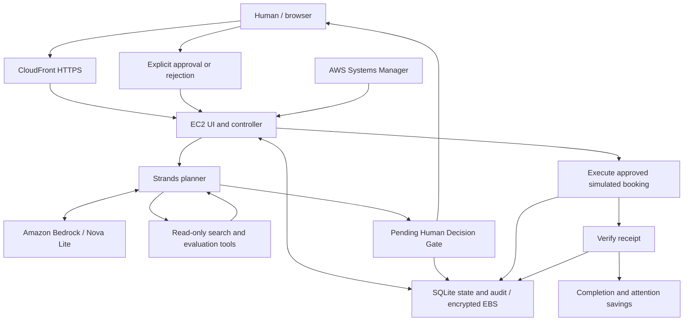

# Live AWS architecture

Demo: https://d2bjqcxkm4ezmd.cloudfront.net

The owner deployed EC2/CloudFront successfully and confirmed both browser decision paths. AgentCore is an optional planner adapter and is **not deployed**.

The agent has no approval or execution tools. Approval is submitted through the owning browser session to the separate controller. Rejection records a terminal decision without executing. Persistent state stays on the EC2 host, outside the autonomous planning loop.

CloudFront caching is disabled and browser cookies/headers are forwarded. Viewer traffic uses HTTPS; the CloudFront-to-EC2 origin uses HTTP restricted by the CloudFront managed prefix list. The host uses IMDSv2 and an instance role for Nova inference; no static AWS keys are installed. This single-host synthetic demo requires stronger origin protection and authenticated user accounts before handling real personal or payment data.

Database state survives restarts. Deleting or replacing the host deletes its root EBS volume; export evidence first. Provider inventory, prices and receipts are simulated even though the Strands/Bedrock reasoning is real.
