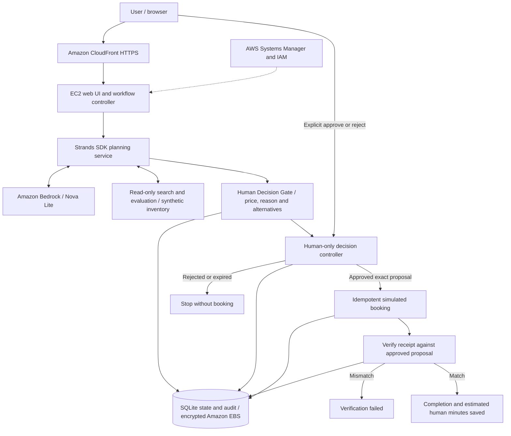

# DecisionPilot AI — AWS architecture

[Live demo](https://d2bjqcxkm4ezmd.cloudfront.net) · [Download PNG](../architecture/architecture.png)

DecisionPilot AI runs on Amazon EC2 behind Amazon CloudFront. The Strands SDK planning service uses Amazon Bedrock Nova Lite to evaluate synthetic car-service appointments. A separate controller handles human decisions, execution, verification and persistent workflow state.

The planning service has read-only search and evaluation tools. It cannot approve proposals or execute bookings. The Human Decision Gate presents the proposed appointment, price, selection reason and alternatives. Only an explicit decision from the requesting browser session can authorize execution; rejection ends the workflow without a booking.

After approval, the controller creates a simulated booking and verifies the receipt against the approved proposal. SQLite stores workflow state, decisions, audit events and receipts on an encrypted Amazon EBS volume. Estimated human minutes saved appear only after successful verification.

CloudFront provides public HTTPS access. Its connection to the EC2 origin uses HTTP, with ingress restricted to the CloudFront managed prefix list. IAM provides scoped access to Bedrock, and AWS Systems Manager supports host administration.

All provider inventory, prices and bookings are simulated. Strands SDK orchestration and Amazon Bedrock inference run in the deployed application.
