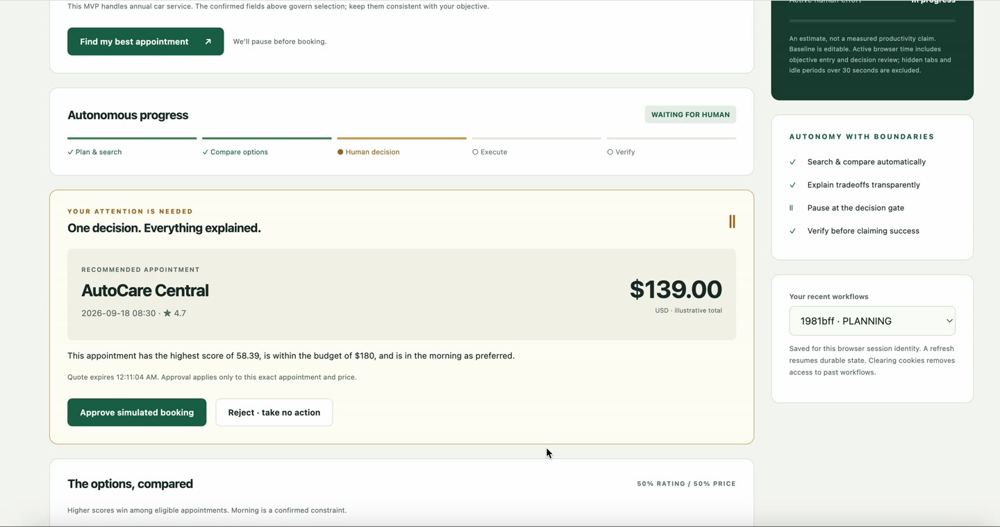
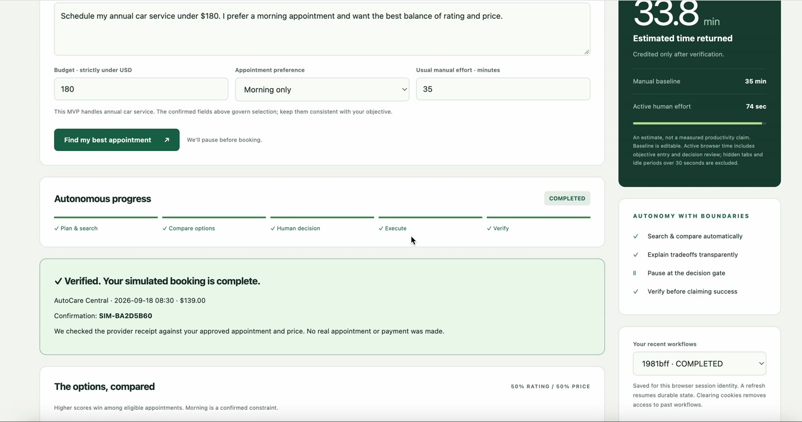
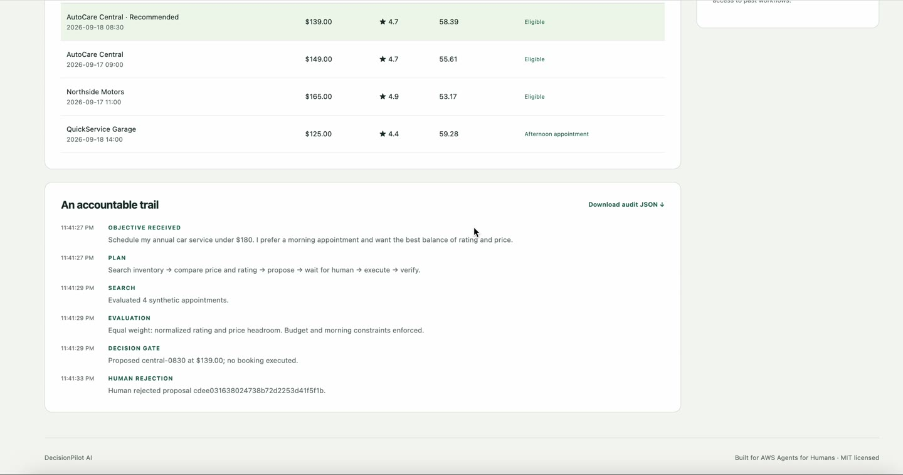

# Recorded demo evidence

The owner supplied a 44.2-second recording of the public Bedrock-mode application. Inspection confirms the pending gate, explicit approval, verified simulated booking, audit trail, displayed 33.8 estimated minutes saved, and a separate rejected workflow. The estimate uses the displayed 35-minute baseline and 74 seconds of active attention; it is not a productivity study.

The edited submission video is 122.3 seconds (2:02), 1920×1080, 30 fps, H.264 MP4. It includes a captioned problem/audience pitch, the complete recorded action sequence slowed to 0.67x with an explicit label, the human-only approval boundary, deployed AWS architecture and project links. Browser toolbar/profile details were cropped. The export is silent and uses on-screen captions; it contains no spoken narration or music. Runtime, codec and rendered frames were checked. The owner supplied the uploaded YouTube URL: https://youtu.be/txn8iroBFnw. This session could not fetch YouTube, so Public visibility and uploaded playback/duration still require owner confirmation.

## Human Decision Gate

## Verified completion and attention budget

## Rejection audit

Source footage is from https://d2bjqcxkm4ezmd.cloudfront.net. Providers, prices and bookings are simulated; the Strands/Bedrock planning integration was separately verified in the live GitHub workflow. AgentCore is not deployed.
